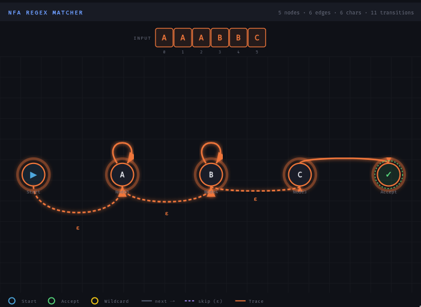

# curiosity-modelling

## Project Objective

To implement matching a string against a regular expression (regex) pattern. Regular expresions are commonly used to describe textual patterns. They can be efficiently matched against as they are equivalent in expressivity to finite automata. 

## Model Design and Visualization

We implement matching against a subset of the full regex standard, namely patterns including `.`, `*`, `?`, and `+`, but without `|` disjunction and `()` character groups. We did this for simplicity, but adding in character groups is not difficult; it amounts to extending the `character` field to a `set`.

This graphic shows the visualizer on the `cascade` test example.

The visualizer on the Script -> SVG tab in Spytial Sterling shows the `Node`s connected as an nondeterministic finite automaton (NFA). The Graph view on Sterling looks complex, but this is largely due to having a few collections of objects: one letter for each letter of the alphabet, `State`s for each `State` in the Input matching, the `Input` sequence, and the `Node`s. The visualizer was written with Claude, but this is the only component of the project besides ideation that used an LLM.

## Signatures and Predicates

Signatures
- `Boolean`, `True`, and `False`
- `Input`, defined by a `string` that is a partial function mapping integers to chars and `length` that is an integer
- `Node`, defining a group of characters in the regex pattern, with fields `character` meaning a literal, `wildcard` indicating whether the node is the `.` operator matching any character, `next` indicating the next node in the pattern (with character consumption), and `skip` indicating epsilon transitions that the node could transition to alternatively (without character consumption). For example, if `l` represents a literal (character) being `N1`, then
    - `l` could be represented with `next = N2` and `skip = NULL`
    - `l?` could be represented by `next = N2` and `skip = N2`
    - `l*` could be represented by `next = N1` and `skip = N2`
    - `l+` could be equivalent to `ll*`
    - `Start`, `Accepting` are distinguished states
- `State` walks through the `Node`s, matching against `Input`
- `Trace` is a partial function that models the sequence of states, with the tuple `(state1, state2, True)` in the function if `state1` maps to `state2`.

The signatures essentially provide the minimum for effectively constructing and walking through the NFA correctly.

Predicates for implementation
- `valid` ensures that everything works as it should. This is separated into several components:
- `validInput` ensures the `Input` string is the right length and has characters
- `validNodes` ensures nodes as they should be, with `Start` and `Accepting` nodes distinguished
- `validStates` ensures that states and the `Trace` work as they should together
- `validTransitions` ensures that the `Trace` and the `Input` work as they should, i.e. the `Nodes` transition according to the `Trace` in a way in alignment with the `Input`

Essentially, the `validInput`, `validNodes`, and `validStates` predicates ensures those objects mean what they should, while the `validTransitions` ensures they work with the `Input`.

## Testing

We have several assertions ensuring certain intuitive properties must hold about the system, such as ensuring that the index does not decrease along the `Trace`.

Predicates for tests
- `loop`: tests that `AAAAAB` matches against the regex pattern `A*B`
- `failed_loop`: shows that matching `BA` against the pattern `A*B` fails due to `validTransitions` failing, while `validInput`, `validNodes`, and `validStates` remain true. 
- `dotStar`: tests that an arbitrarily chosen pattern (`XYZ`) matches agains the regex pattern `.*`
- `cascade`: tests that `AAABBC` matches against the regex pattern `A*B*C`.

Automated Verification:
- Assertions to verify our regex patterns (`loop`, `dotStar`, and `cascade`) are satisfiable, and that our invalid pattern evaluates to unsat.

## Documentation

The code is well-commented.
